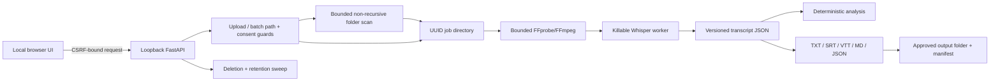

# Architecture

## MVP thesis

- User: an authorized employee reviewing a meeting, interview, lecture, or briefing on a managed Windows endpoint.
- Problem: cloud transcription may be unavailable or prohibited for sensitive recordings.
- Workflow: import one MP4 or select an approved input/output folder pair → validate → transcribe locally → review/search → export or delete managed copies.
- Value hypothesis: a private, time-linked transcript reduces manual review effort while preserving operator control.
- Non-goals: shared accounts, network deployment, speaker diarization, semantic/LLM summarization, live capture, records-management integration, or compliance certification.

## Runtime flow

## Trust boundaries

1. The MP4, filename, MIME type, media metadata, model output, and transcript text are untrusted data.
2. The API binds only to loopback. Trusted-host checks reduce DNS-rebinding exposure; mutation requests require an in-memory request token.
3. Filesystem paths are generated from validated UUIDs. The supplied filename is display metadata only.
4. FFmpeg and Whisper receive explicit local paths and fixed argument lists. No shell interpolation is used.
5. Whisper output is schema-validated before persistence. Analysis never executes instructions in transcript text.
6. Audit events contain IDs, status, reason codes, model ID, and counts, not transcript or media content.
7. Batch paths are relative to one configured workspace root. Traversal, absolute paths, symlink/junction redirects, recursive scanning, excess file/byte budgets, output-name collisions, and overwrites are rejected deterministically.
8. Upload request bytes are bounded before multipart parsing and counted again while copying into managed storage.

## State and data lifecycle

Valid job progression is `queued → validating → extracting → transcribing → analyzing → complete`, with `failed` as the safe terminal state. A user deletion removes the job directory, including source, temporary audio, transcript, and analysis. The startup sweep removes jobs older than the configured retention period. Audit metadata remains but contains no filename or raw content.

The source MP4 and durable derived artifacts are intentionally separate from the temporary WAV. The WAV is removed in a `finally` block after success, failure, or timeout. A killed Whisper worker cannot extend the configured elapsed budget.

A folder batch creates one normal managed job per accepted MP4 and processes jobs sequentially. Each item has an independent terminal result. Selected UTF-8 outputs and a versioned manifest are fsynced to unique same-directory temporary files, then atomically published without overwrite through a hard link. Item, manifest, filesystem, and monitor failures resolve to a visible terminal batch state. Active jobs and batch-owned jobs cannot be individually deleted; completed batch cleanup deletes managed job directories and the batch record while preserving original input files and operator-requested output copies.

## Dependency and provenance boundary

- FFmpeg/FFprobe are organization-provisioned executables discovered on `PATH`.
- Whisper is `openai-whisper==20240930`.
- The local model identifier includes the filename and full SHA-256 digest.
- Transcript and analysis schemas are version `1.0`.
- The JSON export includes source job ID, model ID, timestamps, segments, analysis method, and limitations.
