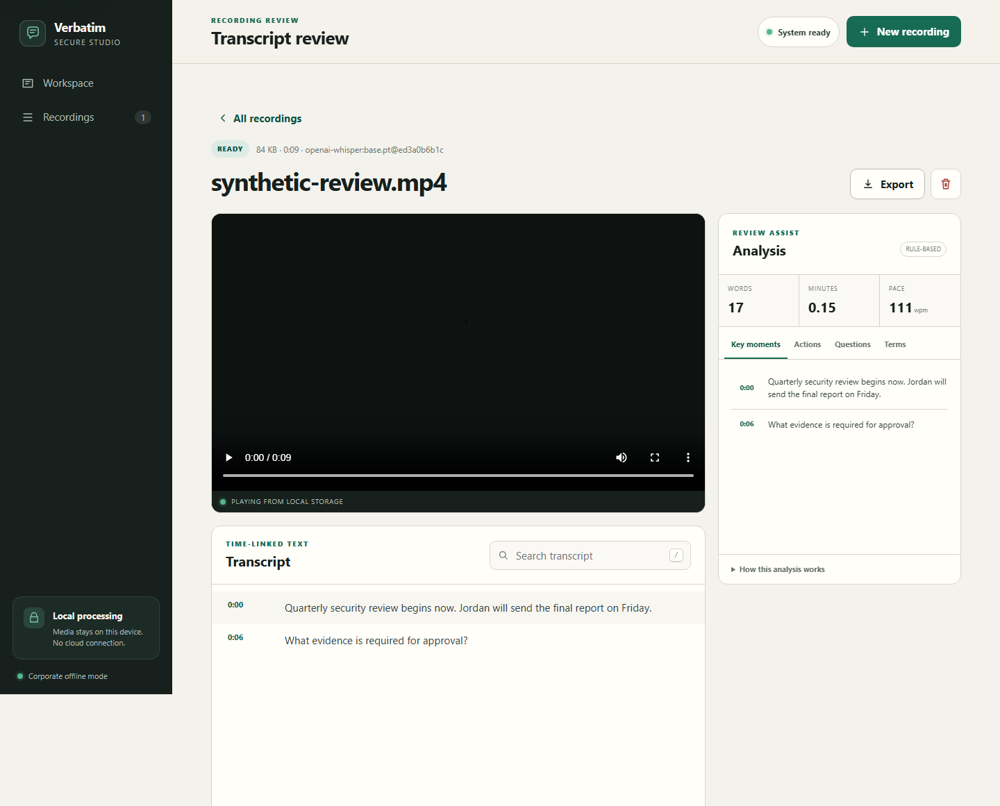

# Verbatim Secure Transcription Studio

Verbatim is a local-first utility for turning MP4 recordings into searchable, time-linked transcripts. It runs on `127.0.0.1`, uses an on-device Whisper model, calls no cloud API, and gives the operator explicit export and deletion controls.



## Verified MVP capability

- Import one MP4 or run a bounded, non-recursive folder batch after authorization confirmation.
- Validate the extension, MIME type, MP4 signature, duration, and audio track.
- Extract 16 kHz mono audio with bounded FFmpeg/FFprobe subprocesses.
- Transcribe with a locally provisioned Whisper model in a killable, time-bounded worker.
- Search time-linked segments and seek the local video from a transcript passage.
- Review deterministic key moments, action-keyword matches, questions, terms, pace, and counts.
- Export TXT, SRT, VTT, Markdown, or a JSON evidence package.
- Write selected formats for each batch file into an approved output folder without overwriting existing files.
- Delete the source, working audio, transcript, and analysis for a job.

The synthetic acceptance fixture passed the real FFmpeg + Whisper path on July 29, 2026. The intended 17-word transcript was reproduced exactly in 16.18 seconds using the local `base.pt` artifact recorded in the evidence packet. This is one controlled fixture, not a general accuracy claim.

## Recorded demonstration

[Watch the narrated end-to-end demo](evidence/demo/verbatim-end-to-end-demo.mp4) or open the [demo evidence index](evidence/demo/README.md). The 114.52-second recording shows authorization, real local processing, transcript search, deterministic analysis, JSON export, readiness, and permanent deletion using synthetic data. Screen recording increased the measured processing time to 80.618 seconds, so only the middle of that wait is played at 12× with an on-screen disclosure.

[Watch the folder-to-folder batch demo](evidence/batch-demo/verbatim-batch-end-to-end-demo.mp4) or inspect its [verification record](evidence/batch-demo/README.md). The 62.2-second recording processes two synthetic MP4s into all five formats, reviews a generated transcript, and removes managed copies while preserving the original input and requested outputs.

## Folder batches

Set `STS_BATCH_ROOT` to an IT-approved workspace. Create an input folder inside that root, place MP4 files directly inside it, and use **Folder batch** in the UI. Input and output values are relative to the configured root; nested scanning, path traversal, symbolic links/junctions, and overwriting existing outputs are blocked.

## Quick start

Requirements: Windows, Python 3.11+, an IT-approved FFmpeg installation, and an approved Whisper `.pt` model stored locally.

```powershell
cd "C:\Claude Cowork\JHU Course\mini_projects\07_secure_transcription_studio"
python -m venv .venv
.\.venv\Scripts\python.exe -m pip install -r requirements.txt
$env:STS_MODEL_PATH = "C:\approved\models\base.pt"
$env:STS_DATA_DIR = "C:\approved\VerbatimData"
$env:STS_BATCH_ROOT = "C:\approved\VerbatimBatchWorkspace"
.\Start-Verbatim.ps1
```

Open `http://127.0.0.1:8765` if the browser does not open automatically.

For an air-gapped installation, have IT create an approved wheelhouse on a connected build machine, scan it, and install with:

```powershell
python -m pip install --no-index --find-links .\wheelhouse -r requirements.txt -c constraints.verified-windows.txt
```

Torch builds are hardware-specific. The organization should select and approve its CPU or GPU package; this repository does not download or silently replace model files.

## Configuration

Copy values from `.env.example` into the service account or launcher environment. Defaults are deliberately bounded:

| Setting | Default | Purpose |
|---|---:|---|
| `STS_MAX_UPLOAD_BYTES` | 2 GiB | Upload budget |
| `STS_BATCH_ROOT` | `<data>/batch-workspace` | Approved folder-to-folder boundary |
| `STS_MAX_BATCH_FILES` | 25 | MP4s per non-recursive batch |
| `STS_MAX_BATCH_BYTES` | 10 GiB | Combined batch input budget |
| `STS_MAX_MEDIA_SECONDS` | 4 hours | Media-duration budget |
| `STS_FFMPEG_TIMEOUT_SECONDS` | 2 hours | Media-tool elapsed budget |
| `STS_TRANSCRIPTION_TIMEOUT_SECONDS` | 2 hours | Killable Whisper elapsed budget |
| `STS_RETENTION_DAYS` | 7 days | Startup retention sweep |
| `STS_MAX_JOBS` | 100 | Local storage/job cap |

The UI shows system readiness before enabling transcription. Model downloads are never attempted; a missing model is a visible blocked state.

## Test and verification

```powershell
python -m pytest
python -m ruff check src tests
python -m compileall -q src tests
node --check src\secure_transcribe\static\app.js
```

Current evidence: 41 tests passed with 82% measured Python coverage including branch tracking; Python compilation, Ruff, JavaScript syntax, PowerShell parsing, and wheel packaging passed. Browser UAT found no console errors or horizontal overflow at desktop, tablet, or 375 px mobile. The real two-file smoke wrote all five formats with two exact synthetic fixture matches, and the recorded batch run completed with zero managed job or batch entries after cleanup. See [evidence/README.md](evidence/README.md).

## Security and claim boundary

This MVP is designed for single-user operation on a managed endpoint. It is not a compliance certification, multi-user server, legal-records system, or proof of transcription accuracy across accents, languages, noise conditions, or domains. Anyone with the same operating-system account and data or batch-workspace access may read stored files. Exported batch files are external copies and remain until the operator or records process removes them. Use full-disk encryption, approved directory ACLs, endpoint protection, and the organization's retention policy.

See [SECURITY.md](SECURITY.md), [ARCHITECTURE.md](ARCHITECTURE.md), and the [readiness decision](governance/READINESS_REPORT.md) before a pilot.
