# L1: system context

## Purpose and scope

Verbatim lets an authorized employee transcribe and review MP4 recordings on a managed Windows endpoint when cloud processing is unavailable or prohibited. It can also preview a strictly bounded CSV/XLSX import manifest before any media acquisition occurs. The current product boundary is one operator, one operating-system account, one loopback process, local executables, local model files, process-memory import plans, and local storage.

## Actors and external systems

| Element | Responsibility | Data exchanged | Trust decision |
|---|---|---|---|
| Authorized operator | Confirms authority, selects media/folders/formats, previews manifests, reviews source-linked text, exports, and deletes | MP4, CSV/XLSX, relative folder choices, transcript review actions | Human authorization is required but not independently verified by the app |
| Endpoint IT/security | Provisions Python, FFmpeg, model, ACLs, egress policy, retention, and budgets | Versioned binaries/configuration; no media-plane request | Infrastructure control remains outside Verbatim |
| Verbatim | Validates, transcribes, analyzes, stores, exports, audits, and deletes managed copies | Local HTTP and local filesystem only | System under evaluation |
| Approved batch workspace | Holds operator-selected input MP4s and requested output copies | MP4 input; TXT/SRT/VTT/MD/JSON output and manifest | Path containment and no-overwrite are enforced; destination policy is external |
| Managed data directory | Holds job/batch state, media copies, transcripts, analyses, and metadata audit | UUID-scoped files and JSONL audit metadata | Application-managed deletion and retention apply |
| Local FFmpeg/FFprobe | Probes MP4 and extracts bounded WAV | Local file paths and process output | Tool output is untrusted; executable provenance is IT-owned |
| Approved Whisper artifact/runtime | Produces timestamped local transcript segments | Temporary WAV, language request, worker-result JSON | Artifact must exist locally and is identified by SHA-256; output is schema-validated |
| Organizational records/DLP process | Governs exported files, backups, incident handling, and retention outside the app | Policy and external-copy lifecycle | Explicitly outside the application control boundary |

## Trust boundaries

1. **Operator boundary:** the browser can request work only through the loopback API. Mutations require an in-memory request token and explicit consent for new processing.
2. **Media boundary:** filenames, multipart fields, MP4 bytes, folder names, file metadata, and media-tool output are untrusted. Extension/MIME checks are advisory; signature, probe, duration, size, count, and path controls decide acceptance.
3. **Process boundary:** FFmpeg/FFprobe and Whisper execute locally with fixed arguments and timeouts. Whisper runs in a killable child process. No shell interpolation is used.
4. **Storage boundary:** internal paths are derived from validated UUIDs. Batch paths must remain below one configured root and cannot cross symlink or junction redirects.
5. **Export boundary:** managed deletion covers the app job/batch tree, not user-requested output copies, backups, or indexes. The UI and documentation disclose that distinction.
6. **Manifest boundary:** CSV/XLSX packages, cells, paths, identifiers, and credential references are untrusted. Preview is request-token protected, size/schema/feature bounded, memory-only, expires within 30 minutes, redacts credential targets, and performs no secret resolution, media acquisition, or job creation.

## L1 quality attributes and gates

| Attribute | Architectural response | Eval IDs | Blocking condition |
|---|---|---|---|
| Privacy | Local-only runtime, no cloud client dependency, minimal audit content | L1-PRIV-01, L1-PRIV-02 | Any production network-client import or raw-content audit path |
| Security | Loopback bind, trusted host, request token, CSP, path containment | L1-SEC-01, L1-SEC-02 | Missing boundary control or mapped regression |
| Governance | Consent gate, explicit export/deletion boundary, evidence-based claims | L1-GOV-01 | Missing architecture/evidence trace |
| Operability | Readiness endpoint, bounded settings, stable error envelopes | L1-OPS-01 | Missing readiness or budget contract |
| Manifest privacy | Default-off preview, no raw upload persistence, redacted response/audit, expiring plans | L1-PRIV-02, L3-MANIFEST-01 | Credential reference in response/audit/disk or acquisition during preview |

## Explicit non-goals

Manifest execution, archive extraction, credential resolution, Zoom access, network deployment, shared accounts, speaker diarization, transcript editing, semantic or LLM summarization, live capture, records-system integration, automatic policy enforcement on exported copies, and compliance certification are not part of the implemented architecture.
