# L2: container architecture

“Container” here means an independently responsible runtime or data store, not necessarily a Docker container. Verbatim is deployed as one Python process plus bounded child processes and a browser tab on one managed endpoint.

## Runtime containers and stores

| ID | Container/store | Implementation | Responsibility | Interface and constraints |
|---|---|---|---|---|
| C1 | Browser UI | `static/index.html`, `app.js`, `styles.css` | Readiness, consent, upload/batch forms, polling, review/search, export, cleanup | Same-origin HTTP only; no third-party script or asset dependency |
| C2 | Loopback API and boundary middleware | `app.py`, `cli.py`, `security.py` | Bind/host/request-token/security headers, request limits, stable API envelopes, route composition | `127.0.0.1`; JSON/multipart; mutation token; no OpenAPI endpoint |
| C3 | Job and batch orchestration | `service.py`, `batch.py` | Job state progression, sequential processing, batch monitoring, cleanup, terminal failures | Bounded executors; explicit cancellation; per-item isolation |
| C4 | Deterministic domain services | `analysis.py`, `exports.py`, `models.py`, `errors.py` | Schema contracts, extractive analysis, five text renderers, stable reason codes | Pure/local logic; Pydantic `extra=forbid` on durable core schemas |
| C5 | Media adapter | `transcription.FFmpegMediaPipeline` | Readiness, ffprobe validation, 16 kHz mono extraction | Fixed argument arrays; elapsed timeout; local paths only |
| C6 | Transcription worker adapter | `transcription.LocalWhisperEngine` and child worker | Model fingerprinting, killable local inference, worker-result validation | Pre-provisioned `.pt`; timeout/cancel; atomic worker JSON handoff |
| C7 | Manifest preview service | `manifest.py`, import-plan models, process-memory store | Strict CSV/XLSX normalization and sanitized expiring preview | Default off; mutation token; no disk/network/secret resolution; 5 MiB/25-row bounds |
| D1 | Managed job store | `storage.JobStore`, `<data>/jobs/<uuid>` | Source copy, job record, transcript, analysis, temporary audio | UUID containment; atomic JSON writes; capacity/retention/deletion controls |
| D2 | Managed batch store | `batch.BatchStore`, `<data>/batches/<uuid>` | Batch record, per-item terminal results, recovery metadata | UUID containment; atomic JSON writes; retention and cleanup |
| D3 | Metadata audit | `<data>/audit/events.jsonl` | Event, ID, reason, model, counts, timestamps | No filenames, media, transcript, secrets, or hidden reasoning |
| D4 | Approved batch workspace | `STS_BATCH_ROOT` | Original MP4 inputs and requested external outputs | Relative/nonrecursive paths, link blocks, count/byte budgets, no overwrite |

## Runtime and deployment topology

- `Start-Verbatim.ps1` starts the Python entry point; `cli.py` rejects non-loopback hosts and unprivileged port values.
- FastAPI and the UI assets share one origin. Trusted-host middleware and an in-memory token reduce DNS-rebinding and cross-origin mutation exposure.
- The job executor has one worker. The batch monitor is also bounded and observes each future so unexpected monitor failures resolve to a visible failed batch state.
- FFmpeg/FFprobe run as bounded subprocesses. Whisper inference runs in a separate process that can be terminated after timeout or cancellation.
- There is no database server, cloud queue, telemetry service, remote model API, CDN, or runtime package download. Import plans are bounded process memory and are lost on expiry or restart.

## Principal data flows

| Flow | Sequence | Durable result | Failure behavior |
|---|---|---|---|
| Single upload | C1 → C2 → D1 → C3 → C5 → C6 → C4 → D1 | Job, transcript, analysis, source MP4, audit metadata | Reject/rollback upload; failed terminal job; temporary WAV removed |
| Folder batch | C1 → C2 → C3 → D4/D1 → C5/C6/C4 → D1 → D4/D2 | Per-item jobs, selected external formats, manifest, batch record | Per-item isolation; no-overwrite atomic publish; visible partial/failed batch |
| Review/export | C1 → C2 → D1/C4 → C1 | Browser review or explicit download | Missing/nonterminal records return stable error envelope |
| Cleanup | C1 → C2 → C3/D1/D2 | Managed trees removed; audit event retained | Running/batch-owned job deletion rejected; external output remains |
| Startup recovery | C2 → D1/D2/C3 | Expired managed state removed; pending batch monitor resumed | Corrupt records excluded; no silent guardrail bypass |

### Manifest preview flow

The browser sends a mutation-token-protected CSV/XLSX request to C2. C2 applies the pre-parser byte cap and C7 validates the untrusted package, creates a sanitized plan in process memory, and writes only plan ID, schema, row count, and manifest SHA-256 to D3. Failure creates no plan or source artifact. C7 has no dependency on C3, C5, C6, D1, D2, D4, a credential provider, or a network client.

## Dependency rules

Production modules use a directed, acyclic responsibility graph where practical. Boundary composition may depend inward; domain modules do not depend on FastAPI, the UI, storage, or media executables. The machine-readable allowlist in `evals/architecture-evals.json` is checked from the Python abstract syntax tree.

Forbidden production dependencies include HTTP clients, cloud SDKs, direct browser-to-tool access, domain-to-API imports, and storage-to-orchestrator imports. A dependency violation fails `L2-DEP-01`.

## L2 capacity and reliability budgets

| Budget/control | Default | Enforced by |
|---|---:|---|
| Upload bytes | 2 GiB | ASGI pre-parser limit and streamed copy counter |
| Batch files | 25 | Preflight scan |
| Batch aggregate bytes | 10 GiB | Preflight scan |
| Media duration | 4 hours | FFprobe result gate |
| FFmpeg elapsed time | 2 hours | Subprocess timeout |
| Whisper elapsed time | 2 hours | Killable process timeout |
| Managed jobs | 100 | Store capacity gate |
| Retention | 7 days | Startup sweep |
| Manifest request | 5 MiB maximum | ASGI pre-parser and streamed route counters |
| Manifest rows | 25 | Strict CSV/XLSX normalization |
| Import-plan lifetime | 30 minutes maximum | Process-memory store expiry |
| Import plans | 100 default | Process-memory capacity gate |
