# L3: component architecture

L3 maps implementation components to their contracts, state transitions, failure behavior, and verification points. It is the level used for code review and regression gating.

## Component catalog

| Component | Public contract | Depends on | Deterministic controls | Primary regression evidence |
|---|---|---|---|---|
| `cli.main` | Start loopback FastAPI on configured port | `create_app`, `require_loopback_host` | Host and port bounds | `test_config_cli.py` |
| `app.create_app` | Compose middleware, routes, stores, adapters, lifecycle | All boundary/orchestration interfaces | Request cap, trusted host, token, consent, readiness, stable errors | `test_api.py` |
| `security` | Sanitize display metadata; validate MP4 metadata/signature; fingerprint files | `StudioError` | No caller path becomes an internal path | `test_security.py` |
| `JobStore` | CRUD for UUID-scoped jobs and derived artifacts; audit; retention | `models`, filesystem | UUID containment, capacity, atomic JSON, deletion | `test_storage.py`, `test_api.py` |
| `JobProcessor` | Submit/cancel/process one job | store, media/transcript protocols, analysis | Single worker, checkpoints, duration gate, terminal failure, WAV cleanup | `test_processor.py` |
| `BatchStore` | CRUD for UUID-scoped batch records | `models`, filesystem | UUID containment, atomic JSON, retention | `test_api.py` |
| `BatchManager` | Preflight, create, monitor, finalize, publish, recover, delete batch | stores, processor, exports | Root containment, link/nonrecursive gates, byte/count caps, item isolation, no overwrite | `test_batch.py`, `test_api.py` |
| `FFmpegMediaPipeline` | `probe`, `extract_audio`, readiness | FFprobe/FFmpeg | Fixed args, timeout, result validation | `test_transcription.py` |
| `LocalWhisperEngine` | `transcribe`, `cancel`, readiness, `model_id` | child process, local model | Existing artifact, SHA-256 identity, timeout/kill, schema validation | `test_transcription.py` |
| `analyze_transcript` | Produce `AnalysisReport` from `TranscriptDocument` | models only | Deterministic extractive rules and explicit limitations | `test_analysis.py` |
| `render_export` | Render TXT/SRT/VTT/MD/JSON | models/errors | Fixed allowlist, UTF-8, provenance in JSON | `test_exports.py` |
| `parse_manifest` | Normalize strict UTF-8 CSV or non-macro XLSX into internal rows | standard library, models/errors | MIME/extension, ZIP/XML, schema, feature, value, count, path, and reference gates | `test_manifest.py` |
| `ImportPlanStore` | Hold and sanitize bounded preview plans | models/errors, process memory | UUID, capacity, expiry, SHA-256, credential-target redaction, no persistence | `test_manifest.py`, `test_api.py` |
| Pydantic models | Versioned job, batch, transcript, analysis, probe, audit contracts | Pydantic | Field bounds and forbidden extras for durable core data | Processor/API/export/transcription tests |

## Interface contracts

### Media and transcript ports

`MediaPipeline` exposes readiness, `probe(source) -> MediaProbe`, and `extract_audio(source, destination)`. `TranscriptEngine` exposes readiness, a provenance-bearing `model_id`, and `transcribe(audio, language) -> (detected_language, segments)`. `JobProcessor` depends on these protocols so failure, timeout, and malformed-output paths can be tested without a real model.

### Persistence contracts

- Job and batch identifiers are canonical UUID strings before paths are resolved.
- JSON is written as UTF-8 to a same-directory temporary file, flushed/fsynced, and atomically replaced.
- Batch exports use a unique temporary file and an atomic hard-link publication. Existing destinations are never overwritten.
- Transcript and analysis records are read through their Pydantic schemas; corrupt records cannot be treated as valid work.
- Preview plans are intentionally non-durable. Only plan ID, manifest SHA-256, schema version, and row count enter metadata audit; uploaded workbook bytes and `secret_ref` targets do not.

### Manifest preview contract

`parse_manifest(filename, content_type, payload)` accepts only the versioned seven-column schema and returns internal typed rows. XLSX is treated as an untrusted ZIP/XML package: unsafe entries, excess expansion, formulas, external relationships, macros, hidden/merged data, embedded features, non-text cells, extra worksheets, unknown columns, and ambiguous row types fail with cataloged reasons. `ImportPlanStore` holds validated rows for at most 30 minutes and maps credential references to provider categories in API previews. Preview has no dependency on processing readiness, storage writes, credential providers, archive tools, or network clients.

### API error contract

Expected failures return `{ "error": { "code": "STABLE_REASON", "message": "safe operator text" } }`. Framework validation is normalized to `REQUEST_VALIDATION_FAILED`; unexpected processor errors become a failed job with `UNEXPECTED_PROCESSING_ERROR`. Raw exceptions, model output, filesystem details, and transcript text are not returned as diagnostics.

## State machines

### Job

Normal progression:

`queued → validating → extracting → transcribing → analyzing → complete`

Any processing state may resolve to `failed`. Cancellation is used only during managed batch cleanup or shutdown and removes managed state; it is not presented as a durable success state. `complete` and `failed` are terminal for operator deletion. A job owned by a retained batch cannot be independently deleted.

### Batch and items

- Batch: `queued → running → complete | partial | failed`.
- Item: `queued → processing → complete | failed`; preflight/per-file rejection produces `rejected`.
- `complete` requires every accepted item to publish every requested output and the manifest.
- `partial` means at least one item completed and at least one failed/rejected.
- `failed` means no item completed or a batch-level monitor/finalization failure prevented a valid success result.

### Import plan

`absent -> validated/in_memory -> expired | process_exit`. Capacity rejection creates no plan. There is no execute transition in STS-106; later execution must add consent, credential, acquisition, deletion, and idempotency states before it can be enabled.

## Failure matrix

| Failure | Safe result | Cleanup | Audit/evidence |
|---|---|---|---|
| Invalid upload/path/consent/token | Request rejected before processing | Partial job setup rolled back | Stable reason code test |
| Missing FFmpeg/model | Readiness attention; processing request rejected | No new work | Health/API regression |
| Media invalid/too long/tool timeout | Job `failed` | Temporary WAV removed | `job_failed` reason code |
| Whisper timeout/cancel/malformed schema | Child terminated or result rejected; job `failed` | Worker/result temporary files and WAV removed | Transcription and processor regressions |
| Export collision/write failure | Existing file preserved; no partial destination | Temporary file removed | Failure-injection regressions |
| Batch monitor exception | Batch reaches `failed` | Managed items remain available for controlled cleanup | Terminal-state regression |
| Delete during active/batch-owned work | HTTP 409 | Nothing removed | Deletion-race regressions |
| Disabled/oversize/malformed manifest | Stable 4xx before plan creation | Uploaded bytes released after request | Manifest API/parser regressions |
| Unsafe XLSX package or ambiguous row | Stable cataloged rejection before secret/network work | No durable artifact | Hostile workbook regressions |
| Plan capacity/expiry/restart | Visible 409/404 or plan absence | Process memory released | Plan-store regressions |

## Data classification and logging

| Data | Classification in this MVP | Durable location | Logging rule |
|---|---|---|---|
| Source MP4/WAV/transcript/analysis | Potentially sensitive content | Managed job tree; WAV temporary | Never write content to audit or console by design |
| Filename/folder path | Potentially identifying metadata | Job/batch record or operator workspace | Audit uses IDs/counts, not names/paths |
| Model ID/hash, durations, counts, reason codes | Operational provenance | Records, export evidence, audit | Allowed when no raw content is included |
| Request token | Secret for current process lifetime | Memory only | Never log or persist |
| Manifest bytes and `secret_ref` target | Potentially sensitive content/metadata | Request memory and expiring plan memory only | Never return target, write to audit, or persist |
| Manifest SHA-256, plan ID, row count, provider category | Operational provenance | Metadata audit and preview response | Allowed; does not establish source authenticity by itself |

## Change rule

A material component, dependency, state, schema, boundary, or quality-attribute change must update this document, the corresponding L1/L2 definition, the eval manifest, mapped tests, risk/backlog records, and generated architecture evidence in the same change.
